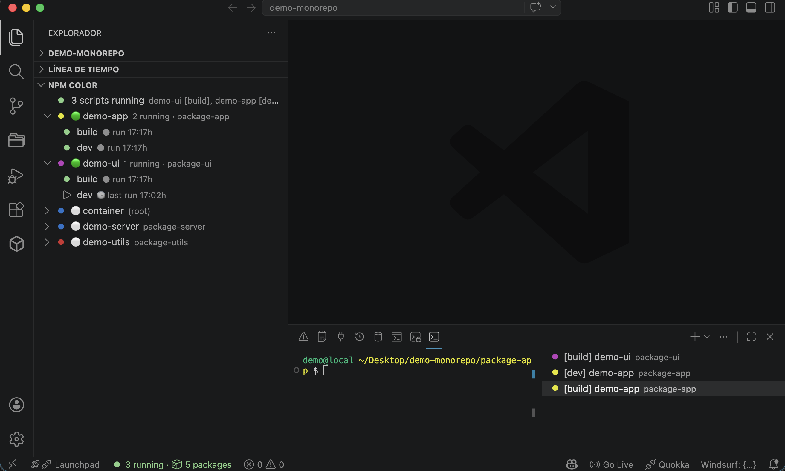
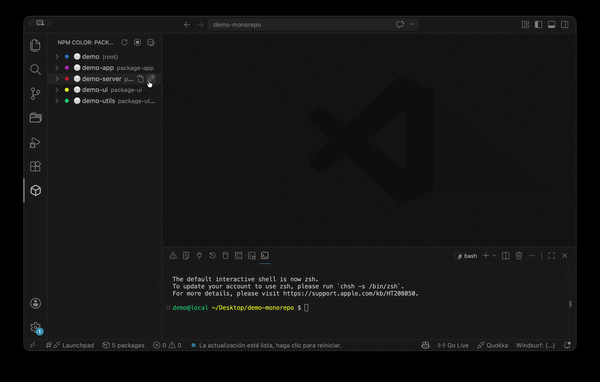
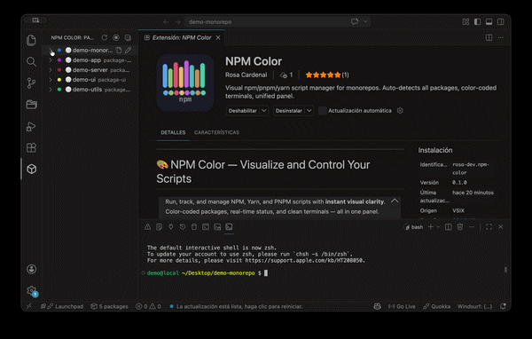

---

# 🎨 NPM Color — Visualize and Control Your Scripts

> Run, track, and manage NPM, Yarn, and PNPM scripts with **instant visual clarity**. Color-coded packages, real-time status, and clean terminals — all in one panel. Perfect for monorepos and multi-service projects.

---
**Panel view with colored packages**
   

## ✨ Key Features

* Color-coded Packages: unique color, icon, and alias per package — recognize projects at a glance.
* Real-time Status: 🟢 Running, ⚪ Idle — no guessing, just look.
* Clean Terminals: each script runs in a terminal that matches the panel’s color and name.
Fully Customizable: edit alias, icon, or color with instant updates.
* Automatic Detection: scans workspace on startup; supports npm, pnpm, and yarn.
* Explorer Panel: appears in Activity Bar by default; optionally show in Explorer panel:

```json
{
 "npmcolor.showInExplorer": true
}
```
**Edit package alias and color**
   

> Easily recognize projects at a glance.

### ⚡ Real-time Script Status

* 🟢 Running
* ⚪ Idle
* No logs. No guessing. Just look.

### 🧵 Clean, Matched Terminals

Each script runs in its own terminal, matching the panel:

```text
🔵 [dev] auth-service
🟡 [build] dashboard-app
```

* Same color
* Same name
* Same identity

> You’ll always know which script is running where.

### ✏️ Fully Customizable

Right-click any package → **Edit**:

* Change alias (display name)
* Change icon
* Change color
* Updates instantly in panel and terminal

**Running scripts in matched terminals**
   

### 🔍 Automatic Detection

* Scans entire workspace on startup
* No need to open files
* Works with npm, pnpm, and yarn

### 📋 Unified Panel

All packages and scripts in one place:

* Real-time status
* Running packages move to the top
* Quick access without cluttered terminals

---

## 🆚 Why NPM Color vs NPM Scripts

| Feature                   | NPM Scripts | NPM Color |
| ------------------------- | ----------- | --------- |
| Auto-detect packages      | ❌           | ✅         |
| Visual identity (colors)  | ❌           | ✅         |
| Running status            | ❌           | ✅         |
| Clear terminals           | ❌           | ✅         |
| Scales with many packages | ❌           | ✅         |

---

## 📦 Ideal For

* Monorepos
* Microfrontends
* Multi-service architectures
* Developers juggling multiple terminals

---

## 📄 License

MIT

---